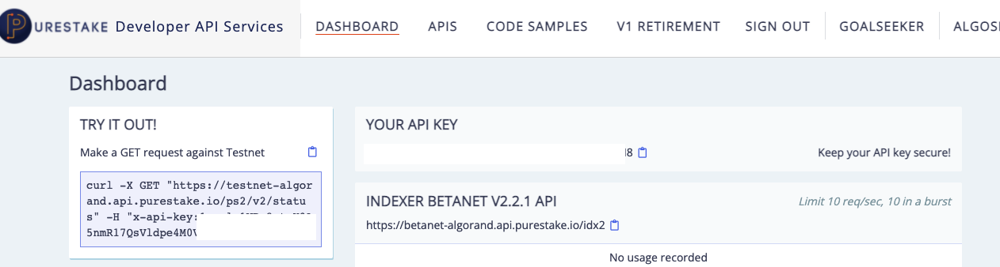

# nft/memecoin Tutorial on Algorand

Let's make a simple NFT/memecoin on the Algorand TestNet! We'll use the [Purestake API](https://www.purestake.com/), [NFT Storage](https://nft.storage/#getting-started), and the [Algorand Python SDK](https://github.com/algorand/py-algorand-sdk) to programmatically create some coins/nfts/assets. [^disclaimer]

> Tip: If you want to speedrun through this tutorial, just read each heading and the `tl;dr`s at the end of the section.

## Pre-requisites
* You should hopefully know how to open the terminal and use a code editor. On MacOS or Ubuntu (any Linux-based OS), just open up your terminal. If you are on Windows, I recommend you install [WSL](https://docs.microsoft.com/en-us/windows/wsl/install), and you will be able to run a Ubuntu terminal on your machine. 
* Your machine should have `git` and `python` installed. 

## Clone this repo 
Open up your terminal and paste the following commands:
```
git clone https://github.com/algochoi/simple-nft-tutorial.git
cd simple-nft-tutorial
python -m venv .venv # optional
source .venv/bin/activate # optional
pip install -r requirements.txt
```

## Create your first [Algorand account](https://developer.algorand.org/docs/get-details/accounts/)
An account consists of a `public key` and a `private key`. 
* The `public key` (aka `wallet address`, or `Algorand address`, which is an encoded form of the public key) is like your banking number/etransfer/venmo handle that people can use to send you money. This is okay to share with your friends.
* The `private key` (aka `secret`, or sometimes `mnemonic`, which refers to a set of English words that can be translated into a private key) is like your banking PIN/password. It's probably not a good idea to share your PIN/passwords in real life either, so **DO NOT** share your `private key` with anyone![^1]

If you run `python create_account.py`, it will automatically generate your address and secret in a private `.env` file. Do not share or upload this file anywhere (by default, `.env` is listed in this repo's `.gitignore`). We will also use this file later to put our API keys. Please just run the script once, or else it will overwrite all your secrets.

> **tl;dr** run `python create_account.py` in this directory and it should generate a `.env` file with your address and secret. **DO NOT** share your secret with anyone. 

## Fund your address
For TestNet, we have a bank/faucet that gives you free Algos to test out your program. Go to the [faucet](https://bank.testnet.algorand.network/), enter your `address` and get some free money. The funds may take ~10 seconds to settle, but you can check out your funds on the blockchain using [AlgoExplorer](https://testnet.algoexplorer.io/) when the money is loaded. Enter your `address` in the search bar and confirm that your balances are set to 10. 


> **tl;dr** Go to the [faucet](https://bank.testnet.algorand.network/), enter your `address` and get some free money. 

## Create a Purestake API-Key and save it to your `.env`
We are going to use an external API to make requests to the blockchain. Sign up for a [free Purestake account](https://developer.purestake.io/). When you log on, you should see your API key (where the greyed out box is in the screenshot below). 



Don't expose that to the world either - write it down in your `.env` file in the `PURESTAKE_KEY` field. 


## Upload your beautiful image using NFT.storage
There are many ways of uploading your data or image, but we will use [NFT.storage](https://nft.storage/), which will store your image in decentralized IPFS. This way, the file should be able to live for a long time in public storage [^2]. Sign up for a free account, click on `Files`, and upload your beautiful image!


Copy the CID from the site and note it down somewhere as we will use it in the next step!

## Customize your coin!
Open `create_nft.py` with your favorite editor, navigate to the top where it says `# Configurable parameters`, and customize your asset by changing the `TOTAL_SUPPLY` (1 means it is a NFT, more than 1 is a custom token/coin/asset), `YOUR_UNIT_NAME`, `YOUR_ASSET_NAME`, and `YOUR_CID` [^3]. When you're done, save your editor and run `python3 create_nft.py`. It should take 5~10 seconds to confirm and finalize your transaction on the blockchain [^4]. 

When the transaction goes through, the Python script should output a link to your new asset! e.g. `Go to Algoexplorer to look at your beautiful asset: https://testnet.algoexplorer.io/asset/your-asset-here`


You should be able to see your new coin/nft on the blockchain! You can view asset information on Algoexplorer by clicking `Technical Information` and then `Creation Tx`, which should show you details about your shiny coin. You can access an `ipfs` url anytime by copying the CID to the end of `https://ipfs.io/ipfs/`, i.e. `https://ipfs.io/ipfs/YOUR_CID_HERE`. Here's a [dummy example](https://ipfs.io/ipfs/bafkreiey5jxe6ilpf62lnh77tm5ejbbmhbugzjuf6p2v3remlu73ced34q). 

> **tl;dr** Edit `create_nft.py` with your token params and run `python3 create_nft.py`. It should generate two links for you to look at your shiny asset.

## Transferring assets
Now that you have created your asset, you might want to send it to someone else. To do this, the receiver needs to [opt-in](https://developer.algorand.org/tutorials/asa-python/#part-3-opt-in) to the asset, have a minimum balance of 0.1 Algo (per asset opted-in), and sign with their `private_key` to confirm this. Then, the owner of the asset can [transfer](https://developer.algorand.org/tutorials/asa-python/#part-4-transfer) the asset to the receiver.

todo: add section/script on asset transfers?

## Additional Resources
* [JavaScript tutorial using Pinata IPFS](https://developer.algorand.org/solutions/minting-nfts-on-algorand-using-ipfs/)
* [Algorand Standards for Assets: ARC-0003](https://github.com/algorandfoundation/ARCs/blob/main/ARCs/arc-0003.md)


[^disclaimer]: As a disclaimer, the opinions expressed are solely my own and do not express the views or opinions of my employer. This is meant to be a short, fun, and somewhat insecure guide to NFTs for complete beginners in a hackathon setting.

[^1]: Note that in this tutorial, we care more about speed so we may do potentially unsafe stuff with your `private key`. If you are using real funds, make sure you are using [kmd](https://developer.algorand.org/docs/clis/kmd/) or some other secure way for storing your secrets.

[^2]: There are certain best practices when using IPFS because it is a decentralized store. If you are very serious about storing your image/data, you should pin the data against a machine that you also own in addition to relying on other machines. 

[^3]: The more technical convention for NFTs, as described by [EIP1155](https://eips.ethereum.org/EIPS/eip-1155) or [ARC-0003](https://github.com/algorandfoundation/ARCs/blob/main/ARCs/arc-0003.md), is to have a link to your metadata JSON file here. But I've abstracted that layer away from this tutorial. A "NFT" is essentially a link to a JSON that contains a link to your data/image/file.

[^4]: On a more technical note, different blockchains have different block times and different finality times. Block time, imo, does not really matter compared to transaction finality times because the user only cares whether their transaction went through or not rather than individual blocks. According to this [source](https://www.dfinitycommunity.com/internet-computer-vs-layer-1-blockchains/#:~:text=Solana%20uses%20%22Optimistic%20Confirmation%22%20that,its%20Proof%20of%20Stake%20consensus.), Ethereum has \~5 minute finality time, Solana is \~13s, Algorand is \~5s, while Avalanche is \~3s.
